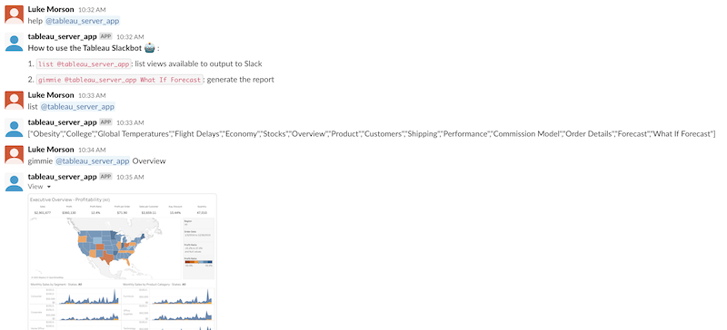
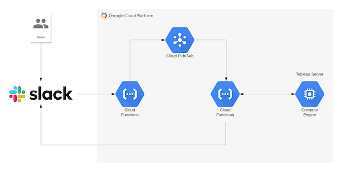
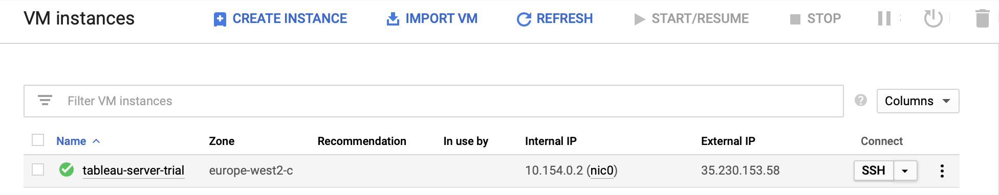
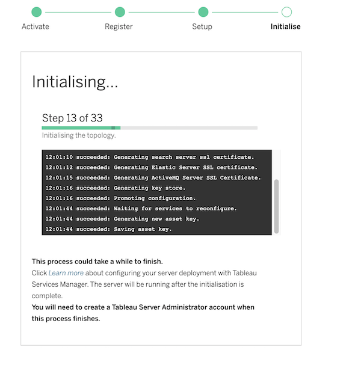
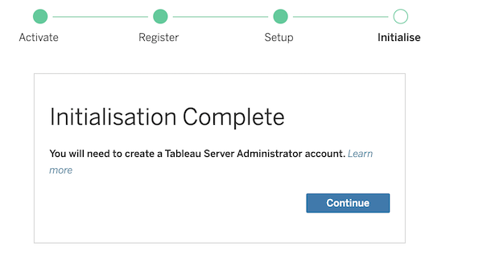
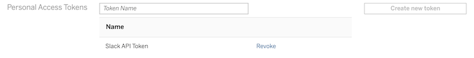
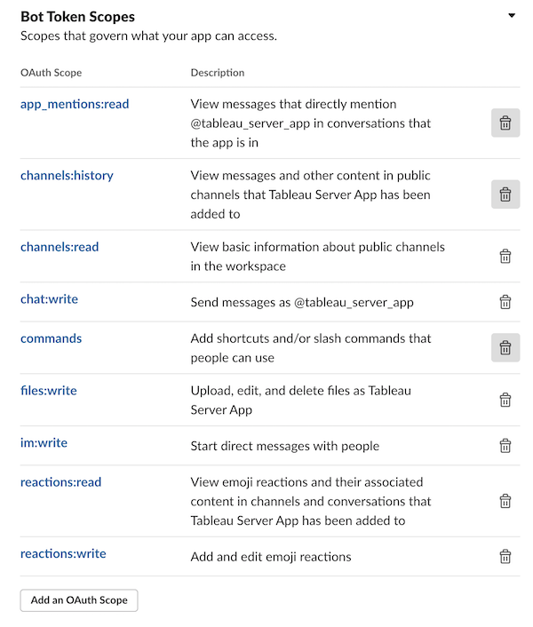
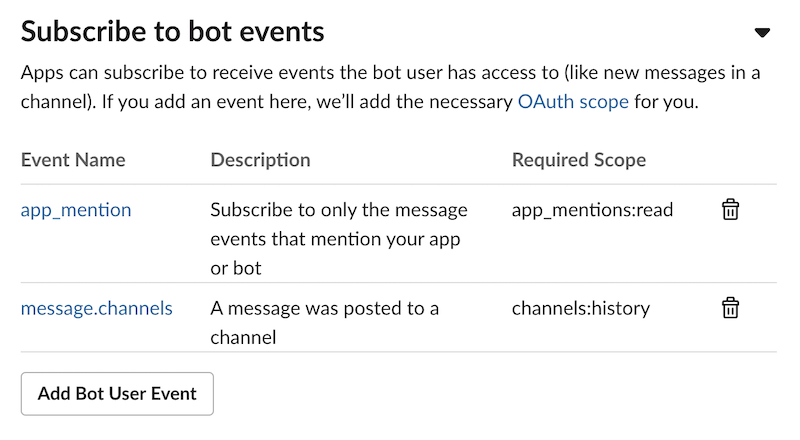
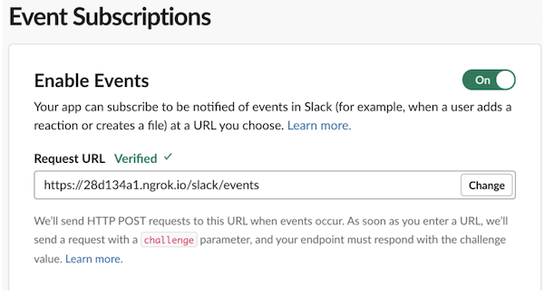

# Giving Tableau Server some Slack

>**Aim**: Build a basic Slackbot for Tableau Server in the Google Cloud Platform

⚠️ Any resources created in GCP are not secure and should only be used in a test environment 


### What you'll find here...

1. A way to deploy a basic trial instance of Tableau Server in GCP using Terraform
2. A simple Slackbot for Tableau Server based on Cloud Functions and Pub/Sub resources in GCP
3. A simple Python application for [local testing](./test/local/slackbot/README.md)


### Basic Functionality

The basic functionality allows for the user to list the views available from the default Tableau site, and generate an image of the view in Slack.




### Basic component architecture




### Requirements

1. Google Cloud Platform account
2. [Google Cloud project](https://cloud.google.com/resource-manager/docs/creating-managing-projects)
3. GCP service account credentials ([Getting Started with the Google Provider](https://www.terraform.io/docs/providers/google/guides/getting_started.html))
4. Terraform
4. [Homebrew](https://brew.sh/) & [tfswitch](https://warrensbox.github.io/terraform-switcher/)
5. Tableau Server
6. Slack App 


## Create an instance of Tableau Server on GCP 

> You don't have an instance of Tableau Server? No problem... 
> Let's create a basic, single-node instance of Tableau Server on Linux, in GCP, using Terraform

1.. Update the variables in `variables.tf` if required to change the region and zone. Export the project as an environment variable 

```bash
export TF_VAR_project="XXX"
```

2. Export the path to the contents of a service account key file in JSON format

```bash
export GOOGLE_CREDENTIALS="/path/to/file.json"
```

3. Update the details for the trial license in [reg_temp.json](./terraform/gcp/tableau_server/templates/reg_templ.json.tpl)

4. Deploy Tableau Server

```bash
# from the project root
make tableau
```

5. Once the VM is created you can SSH in and monitor the installation process. The `startup.sh` script automates the installation of a basic instance of Tableau Server.

* Navigate to Computer Engine -> VM instances



```bash
# tail the logs
sudo tail -f /var/log/messages

# or use the journalctl command to view startup script output
sudo journalctl -u google-startup-scripts.service
```

6. Tableau Server ships with [Tableau Services Manager](https://help.tableau.com/current/server-linux/en-us/tsm_overview.htm) (TSM), which you can use to configure and administer Tableau Server.  After a period of time you can monitor the installation via the TSM UI at `https://{External IP}:8850`. Login with the admin credentials from the startup-script.

```bash
username=reporting
password=reporting
```



7. Monitor the progress of the installation, and once complete, access Tableau Server by clicking "Installation Complete" or via the External IP. Login with the same credentials above.



8. Generate a Personal Access Token called 'Slack API Token' and store for use later:
* Navigate to `My Account Settings` -> `Personal Access Tokens`




## Configure the Slack application

1. Create a slack app

2. Grab the bot token from `OAuth & Permissions`. A bot token in your app lets users at-mention it. It makes it possible for users to interact with your app in Slack. 

3. Adjust your Bot Token’s permissions in OAuth & Permissions. Configure the bot user give access to certain scopes:



4. Subscribe to bot events so the app can subscribe to receive events the bot user has access to:



## Create the Tableau Slackbot

This will create the following resources: 

| Resource | Description | 
|   ---    |      ---    |
| Pub/Sub Topic: `slack-event-data` |  Receives messages from the Cloud Function `slackbot-publish` |
| Cloud Function: `slackbot-publish` | Handles the Slack events and Publishes to the Pub/Sub topic |
| Cloud Function: `slackbot-publish-consume` | Consumes the events from the topic `slack-event-data` and decides how to respond | 

1. Set the environmental variables:

```
export TF_VAR_project=$GCP_PROJECT_NAME
export TF_VAR_SLACK_SECRET=$SLACK_SIGNING_SECRET
export TF_VAR_SLACK_API_TOKEN=$SLACK_BOT_TOKEN
export TF_VAR_TABLEAU_TOKEN=$TABLEAU_TOKEN
export TF_VAR_TABLEAU_SERVER_URL=$TABLEAU_SERVER_URL
export GOOGLE_CREDENTIALS="/path/to/file.json"
```

2. Create the Cloud Functions and Pub/Sub Topic:

```bash
make cloudfunctions
```

3. Add the output of the HTTP trigger URL from the `slackbot-publish` Cloud Function to the Slack Event Subscriptions along with `/slack/events`. Slack will send an HTTP request there when your app is mentioned.  



4. Test functionality

```bash
# see functionality
help @tableau_server_app

# list available views
list @tableau_server_app

# generate view
gimmie @tableau_server_app Obesity
``` 


### Destroy

Destroy all resources:

```bash
make destroy
```