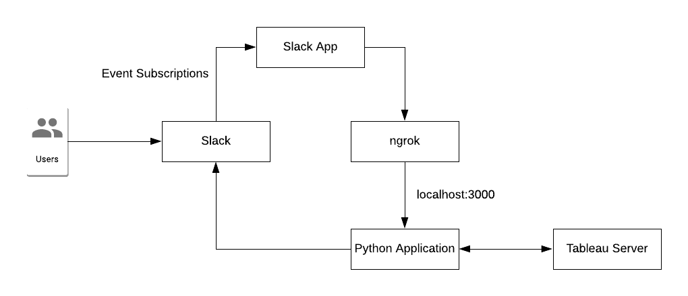

# Local testing

> Provides a simple, raw python application for testing the functionality locally



### Requirements

1. Slack environment and Slack App configured with Event Subscriptions
2. [ngrok](https://ngrok.com/) installed as a proxy to forward requests to your local machine
3. Tableau Server setup with a `Personal Access Token` called `Slack API Token` for API access

***

1. Setup the virtualenv:

```bash
# create a virtualenv
virtualenv -p $(which python3) venv

# activate venv 
source venv/bin/activate

# install requirements
pip install -r requirements.txt
```

2. Export the environment variables:

```bash
export SLACK_SIGNING_SECRET=$SLACK_SIGNING_SECRET
export SLACK_BOT_TOKEN=$SLACK_BOT_TOKEN
export TABLEAU_TOKEN=$TABLEAU_TOKEN
export TABLEAU_SERVER_URL=$TABLEAU_SERVER_URL
export VIEW_FILE_LOCATION="/path/to/store/view.png"
```

3. Run `ngrok` in a separate terminal. This acts a proxy to allow local development:

```bash
./ngrok http 3000
```

4. Start the Python application:

```bash
python slackbot/tableau_slackbot.py
```

5. Add link to Request URL to the Event Subscriptions in the Slack app. Add `/slack/events` endpoint to allow the application to respond to the challenge request from Slack.

```bash
Forwarding    https://cd6c6771b5bf.ngrok.io -> http://localhost:3000
```

6. Test functionality in Slack:

```bash
# see functionality
help @tableau_server_app

# list available views
list @tableau_server_app

# generate view
gimmie @tableau_server_app Obesity
```